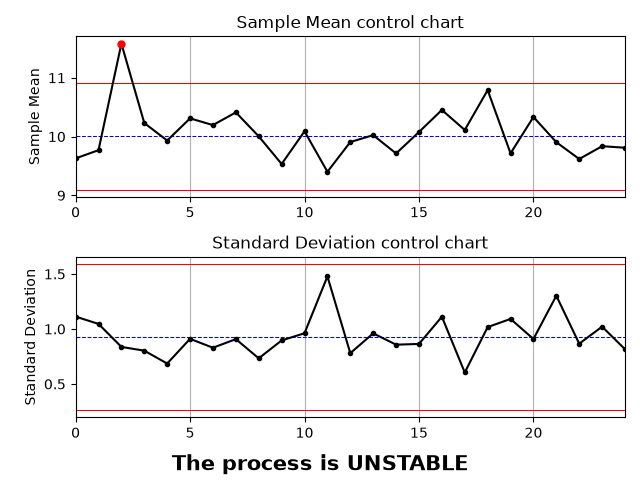
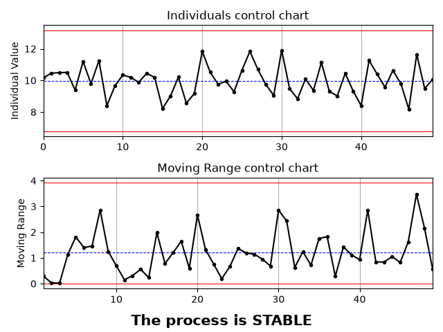
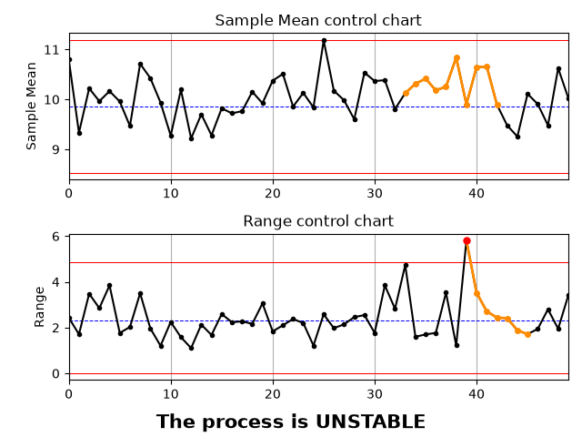
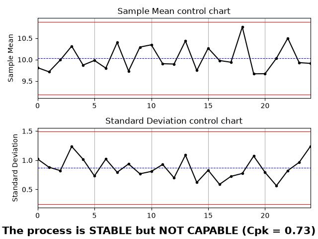
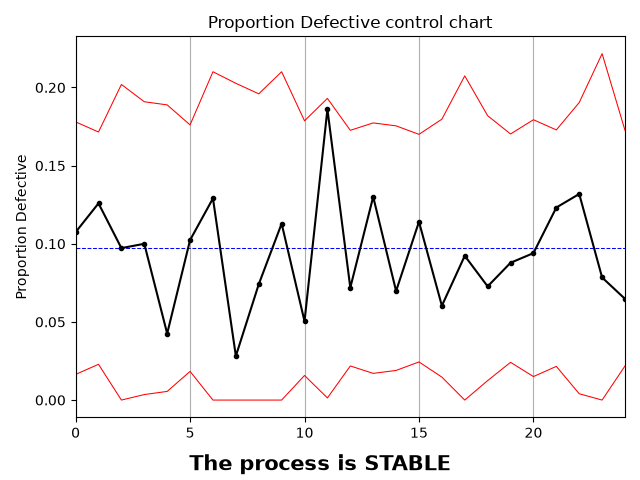
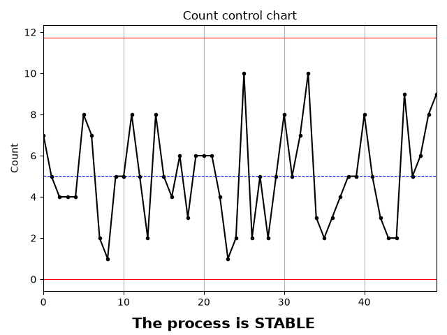
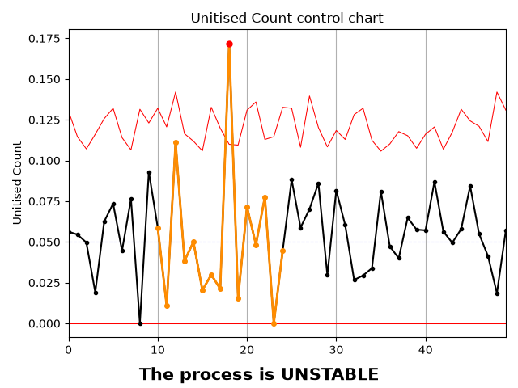

# SPC Python Engine
Modular Python engine for Statistical Process Control (SPC) designed to generate control charts (Phase 1 baseline and Phase 2 tracking), detect Western Electric / Nelson patterns, and calculate process capability (Cp and Cpk).

# Requirements
- numpy
- scipy
- pandas
- matplotlib

# Example Output (X-S Chart with special cause variation)


# Core API 
## SPC_run()
Analyze a dataset through an SPC chart pipeline.

### Arguments:
- df (pd.DataFrame): The input dataset containing process measurements and sample sizes.
- chart_type (str): The control chart type. Supported: "I-MR", "X-R", "X-S", "C", "U", "P", "NP".
- reference (object/tuple, default: None): Reference chart limits from Phase 1. If None, triggers Phase 1 limit estimation. If passed, executes Phase 2 monitoring.
- lsl (float, default: None): Lower Specification Limit (required for capability analysis).
- usl (float, default: None): Upper Specification Limit (required for capability analysis).
- target (float, default: 1.33): Target Cpk threshold for capability success.
- plot (bool, default: True): Whether to render the matplotlib control chart visualization.

### Returns:
A dictionary containing analysis outputs:
- "chart": The underlying chart object(s). -> use as reference for phase 2
- "stable_flag" (bool): True if the process is statistically stable (based on rule 1).
- "pattern_flag" (bool): True if any Nelson/Western Electric rules were triggered (except rule 1).
- "text" (str): Summary status of the stability assessment.
- "capability_flag" (bool): True if Cpk >= target (only returned if specification limits are provided).
- "Cp", "Cpk" (float): Process capability metrics (only returned if specification limits are provided).

# Supported Chart Types
| Chart Type | Data Type | Sample Size (n-bar) | Description |
|:---|:---|:---|:---|
| I-MR  | Continuous    | n = 1             | Individuals and Moving Range  |
| X-R   | Continuous    | n >= 2 (Fixed)    | Mean and Range                |
| X-S   | Continuous    | n >= 2 (Fixed)    | Mean and Standard Deviation   |
| C     | Count         | Fixed             | Defects per unit              |
| U     | Count         | Variable          | Defects per sample            |
| P     | Proportion    | Variable          | Fraction defectives           |
| NP    | Count         | Fixed             | Defectives per unit           |

# Test Data Generators
To facilitate  testing and simulation, 3 built-in generators allow to generate DataFrames ready to use with SPC_run()

- generate_normal_data(m, n, mean, sd, special_cause_ratio, shift_size)
    - Used for continuous variable charts (I-MR, X-R, X-S).
- generate_poisson_data(m, n, rate_lambda, special_cause_ratio, shift_rate)
    - Used for count-based attribute charts (C, U).
- generate_binomial_data(m, n, p, special_cause_ratio, shift_p)
    - Used for proportion-based attribute charts (P, NP).

# Python Example
```python
# /!\ filepath
from test import generate_normal_data
from main import SPC_run  

# 1. Generate baseline data for Phase 1
df_phase1 = generate_normal_data(m=25, n=5)

# 2. Run Phase 1 Analysis
result_p1 = SPC_run(df_phase1, "X-R", lsl=8, usl=12, plot=True)
chart_reference = result_p1["chart"]

# 3. Generate Phase 2 data with a 5% special-cause shift
df_phase2 = generate_normal_data(m=25, n=5, special_cause_ratio=0.05)

# 4. Run Phase 2 Analysis (passing Phase 1 chart limits as reference)
result_p2 = SPC_run(df_phase2, "X-R", reference=chart_reference, lsl=8, usl=12, plot=True)
```

# Chart Gallery
Here is a preview of various control charts and capability analyses supported by the engine:

## Continuous Charts (Phase 1 & 2)







## Attribute & Variable Sample Size Charts




